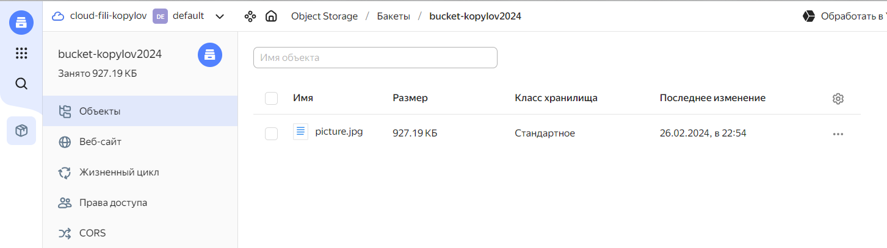
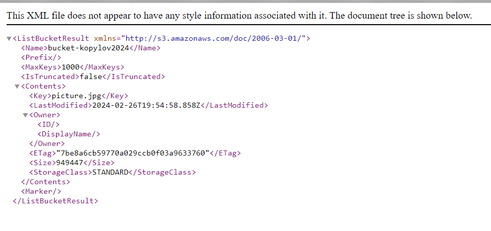
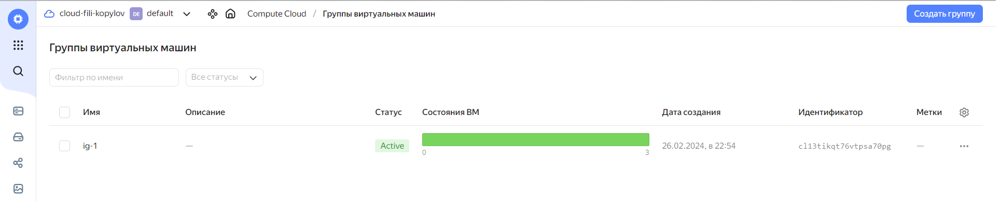
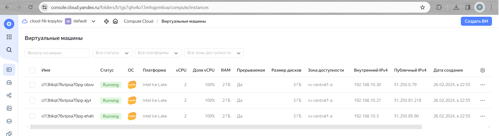
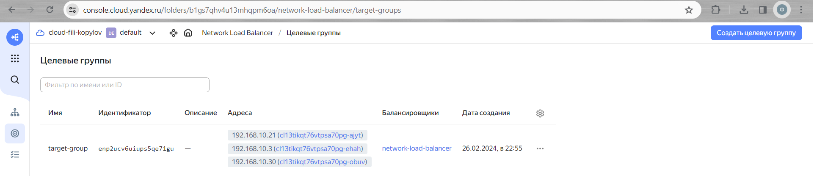
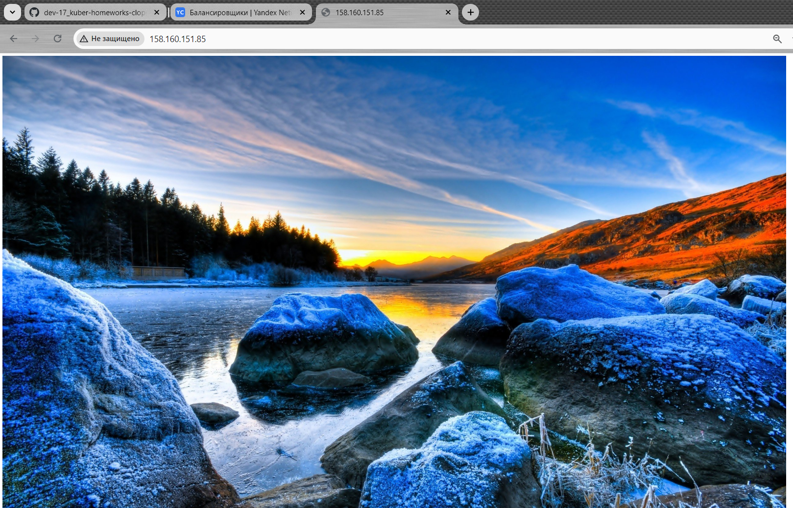
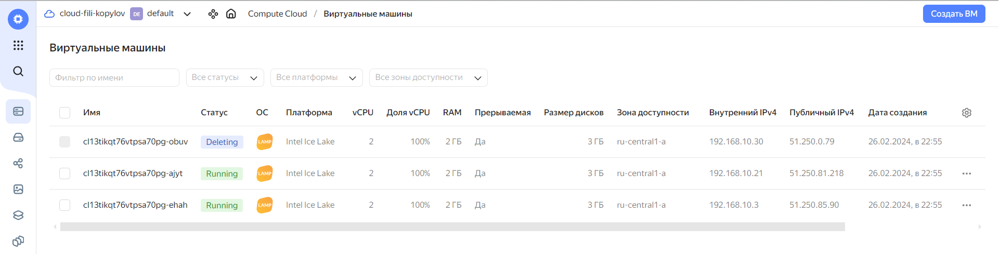
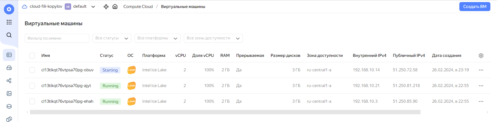

# Домашнее задание к занятию «Вычислительные мощности. Балансировщики нагрузки»
«Вычислительные мощности. Балансировщики нагрузки»

### Подготовка к выполнению задания

1. Домашнее задание состоит из обязательной части, которую нужно выполнить на провайдере Yandex Cloud, и дополнительной части в AWS (выполняется по желанию). 
2. Все домашние задания в блоке 15 связаны друг с другом и в конце представляют пример законченной инфраструктуры.  
3. Все задания нужно выполнить с помощью Terraform. Результатом выполненного домашнего задания будет код в репозитории. 
4. Перед началом работы настройте доступ к облачным ресурсам из Terraform, используя материалы прошлых лекций и домашних заданий.

---
## Задание 1. Yandex Cloud 

**Что нужно сделать**

1. Создать бакет Object Storage и разместить в нём файл с картинкой:

 - Создать бакет в Object Storage с произвольным именем (например, _имя_студента_дата_).
 - Положить в бакет файл с картинкой.
 - Сделать файл доступным из интернета.

#### Решение

   - Конфигурация [Бакета](./terraform/backet.tf)  

   - Скрин Бакета из YC  
     

   - Скрин картинки в Бакете  
   

Полученная ссылка для скачивания -  https://storage.yandexcloud.net/bucket-kopylov2024/picture.jpg

 
2. Создать группу ВМ в public подсети фиксированного размера с шаблоном LAMP и веб-страницей, содержащей ссылку на картинку из бакета:

 - Создать Instance Group с тремя ВМ и шаблоном LAMP. Для LAMP рекомендуется использовать `image_id = fd827b91d99psvq5fjit`.
 - Для создания стартовой веб-страницы рекомендуется использовать раздел `user_data` в [meta_data](https://cloud.yandex.ru/docs/compute/concepts/vm-metadata).
 - Разместить в стартовой веб-странице шаблонной ВМ ссылку на картинку из бакета.
 - Настроить проверку состояния ВМ.

#### Решение

   - Конфигурация [Instance Group](./terraform/InstanceGroup.tf)

   - Скрин Instance Group  
   

   

   - Скрин Target Group
    

   - Скрин картинки на инстансах из Instance Group 
   

3. Подключить группу к сетевому балансировщику:

 - Создать сетевой балансировщик.
 - Проверить работоспособность, удалив одну или несколько ВМ.

#### Решение

- Конфигурация [load-balancer](./terraform/loadbalancer.tf)

- Проверка работоспособности при удалении одной машины

4. (дополнительно)* Создать Application Load Balancer с использованием Instance group и проверкой состояния.

### Общая конфигурация [Terraform](https://github.com/filipp761/Netology-DevOps/tree/main/clopro-homeworks/15.2/terraform)

Полезные документы:

- [Compute instance group](https://registry.terraform.io/providers/yandex-cloud/yandex/latest/docs/resources/compute_instance_group).
- [Network Load Balancer](https://registry.terraform.io/providers/yandex-cloud/yandex/latest/docs/resources/lb_network_load_balancer).
- [Группа ВМ с сетевым балансировщиком](https://cloud.yandex.ru/docs/compute/operations/instance-groups/create-with-balancer).

### Правила приёма работы

Домашняя работа оформляется в своём Git репозитории в файле README.md. Выполненное домашнее задание пришлите ссылкой на .md-файл в вашем репозитории.
Файл README.md должен содержать скриншоты вывода необходимых команд, а также скриншоты результатов.
Репозиторий должен содержать тексты манифестов или ссылки на них в файле README.md.
