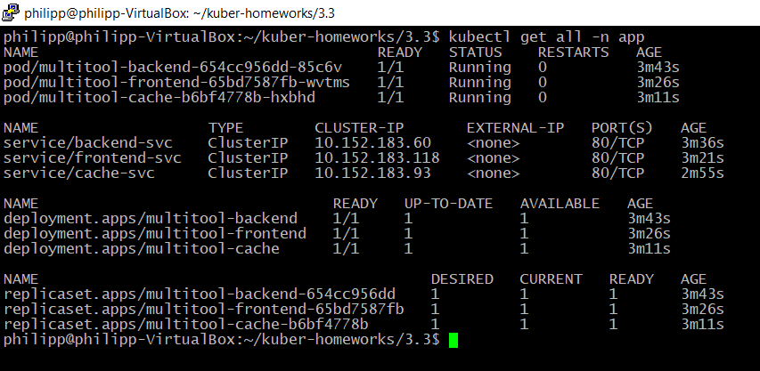
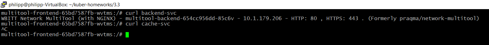
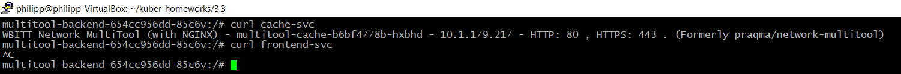
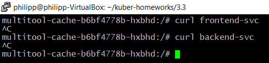

# Домашнее задание к занятию «Как работает сеть в K8s»

### Цель задания

Настроить сетевую политику доступа к подам.

### Чеклист готовности к домашнему заданию

1. Кластер K8s с установленным сетевым плагином Calico.

### Инструменты и дополнительные материалы, которые пригодятся для выполнения задания

1. [Документация Calico](https://www.tigera.io/project-calico/).
2. [Network Policy](https://kubernetes.io/docs/concepts/services-networking/network-policies/).
3. [About Network Policy](https://docs.projectcalico.org/about/about-network-policy).

-----

### Задание 1. Создать сетевую политику или несколько политик для обеспечения доступа

1. Создать deployment'ы приложений frontend, backend и cache и соответсвующие сервисы.
   * deployment'ы: [frontend](./src/frontend_deployment.yaml),[backend](./src/backend_deployment.yaml),[cache](./src/cache_deployment.yaml)
   * сервисы: [frontend](./src/frontend-svc.yaml),[backend](./src/backend-svc.yaml),[cache](./src/cache-svc.yaml)
2. В качестве образа использовать network-multitool.
3. Разместить поды в namespace App.
4. Создать политики, чтобы обеспечить доступ frontend -> backend -> cache. Другие виды подключений должны быть запрещены.
   * Создать [политики](./src/police-app.yaml)
5. Продемонстрировать, что трафик разрешён и запрещён.
   

